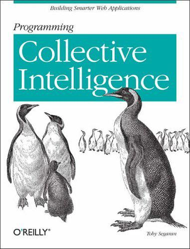

# Programming Collective Intelligence

### Contents

* chapter1: Introduction to Collective Intelligence
* chapter2: Making Recommendations
* chapter3: Discovering Groups
* chapter4: Searching and Ranking
* chapter5: Optimization
* chapter6: Document Filtering
* chapter7: Modeling with Decision Trees
* chapter8: Building Price Models
* chapter9: Advanced Classification: Kernel Methods and SVMs
* chapter10: Finding Independent Features
* chapter11: Evolving Intelligence
* chapter12: Algorithm Summary

### Requirement

* python

### further programming

* chapter11: simplify the generated `tree programs`
